## Présentation Générale

#### Nom du jeu : *pyfort*

#### Contributeurs :
· LEFEVRE Maxime \
· ROY-NOUGHIER Erwann

#### Description 
Projet python dans le cadre des études à l’EFREI paris du module TI101, nous sommes amenés à développer un simulateur inspiré du célèbre jeu télévisé Fort Boyard. L'objectif est de recréer une expérience où une équipe de joueurs doit réussir plusieurs épreuves et récolter trois clés. Une fois ces clés obtenues, l'équipe pourra participer à l’épreuve finale et tenter de débloquer la salle du trésor.
#### Fonctionnalités Principales :
Des épreuves de mathématiques, de hasard, de logique, l’énigme du père fourras, la salle au trésor avec la devinette des 3 indices et un historique des modules joués.
**La liste complète des épreuves se trouve dans la documentation technique, plus loin dans ce document**
#### Technologies Utilisées:
·Python\
·Les bibliothèque random et json\
·Un kanban (https://github.com/users/JeanChipo/projects/5) \
·Git

#### Installation sur windows :

Cliquer sur le bouton vert \[<> Code] sur ce dépôt github
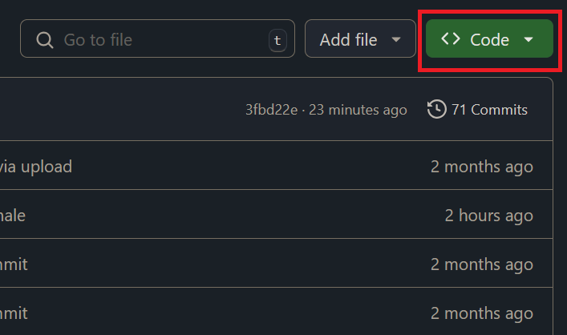

Cliquer sur le bouton \[Download ZIP]
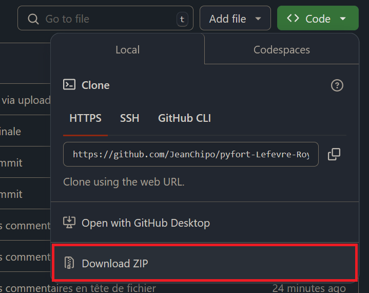

Extraire le fichier .zip téléchargé

#### Utilisation :

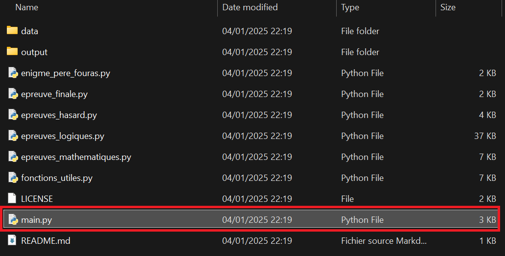

Pour lancer le jeu, il suffit d’exécuter le fichier main.py provenant du fichier .zip extrait

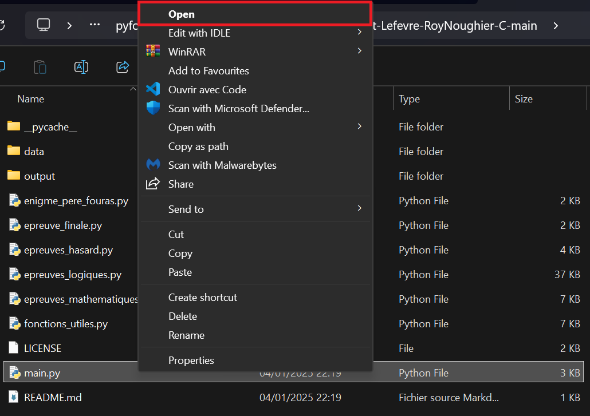
Une fois le jeu lancé, toutes les instructions vous seront données dans l’invite de commande. Pour interagir avec le jeu il vous suffira de taper vos réponses dans l’invite de commande puis d’appuyer sur la touche \[entrée].

## Documentation Technique :

#### Algorithme du jeu :
Au début du code on affiche tous les règles du jeu. On demande ensuite à l’utilisateur de composer son équipe qui devra réussir les épreuves pour remporter le jeu. Après ces premières étapes on lance le jeu grâce à une boucle. Cette boucle demande à quel genre d’épreuve l’utilisateur veux jouer et quel membre de son équipe (composée au début) y participe. Après avoir demandé ses informations, la boucle exécute aléatoirement l’une des épreuves de la catégorie choisie et renvoie si l'épreuve a été gagné ou perdu. Si elle a été gagnée, on incrémente le compteur de la clé de 1. Quand l’équipe du joueur arrive à trois clés on lance l’épreuve final qui consiste à trouver un mot via 3 indices. Si cette épreuve est réussie l’équipe gagne le jeu, sinon l’équipe a perdu.

#### Liste des fonctions implémentées :

1. **Le module epreuves_mathematiques.py** \
	1.1. Épreuve de la Factorielle \
	1.2. Épreuve d'Équation Linéaire \
	1.3. Épreuve des Nombres Premiers \
	1.4. Épreuve de la Roulette Mathématique \
	1.5. Fonction epreuve_math() pour la sélection aléatoire d'une épreuve \

2. **Le module epreuves_hasard.py** \
	2.1. Bonneteau \
	2.2. Lancer de dés \
	2.3. Fonction epreuve_hasard() pour la sélection aléatoire d'une épreuve \

3. **Le module epreuves_logiques.py** \
	3.1. Jeu de NIM ou les bâtonnets \
	3.2. Le Morpion ou tic-tac-toe \
	3.3. Jeu de bataille naval 

4. **Le module enigme_pere_fouras.py** 

5. **Le module epreuve_finale.py** 

6. **Le module fonctions_utiles.py** \
	6.1. Fonction introduction() \
	6.2. Fonction composer_equipe() \
	6.3. Fonction menu_epreuves() \
	6.4. Fonction choisir_joueur(equipe) \
	6.5. Fonction bonus enregistrer_historique 

7. **Fonction principale - main.py**

***Les explications des fonctions et les détails des paramètres se trouvent en commentaire dans les docstrings des fonctions.***

#### Gestion des Entrées et Erreurs :
Une vérification des entrées utilisateur est appliquée à chaque fois, s’assurant une saisie adaptée à la situation. Cela s’effectue par diverses fonctions comme est_entier() ou est_décimal(), ainsi que directement dans les fonctions le nécessitant.

#### Liste des bugs connus :
Il n’y a pas de bugs connus, je vous invite donc à ouvrir une issue sur le dépôt github si vous en rencontrez, afin qu’il puisse être corrigé.

#### Journal de Bord
Tout fut géré par le kanban associé à ce dépôt github. Voici le lien : [https://github.com/users/JeanChipo/projects/5](https://github.com/users/JeanChipo/projects/5)

#### Tests et Validation
Quelques exemples :

*Si le joueur ne saisit pas un nombre de joueur entre 1 et 3 ou qu’il saisit autre chose qu’un chiffre (saisie vide inclue), on lui demande de saisir un nombre de joueurs valide.*
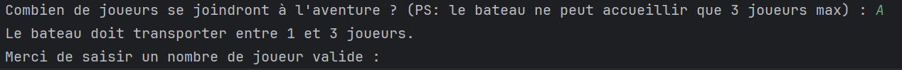

*Si le joueur ne saisie pas de nom ou de profession, un message lui demande d’effectuer une saisie.*
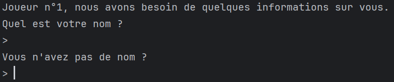
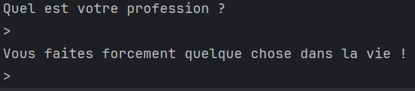

*Si personne ne se dévoue comme leader, le premier joueur est sélectionné comme leader.*
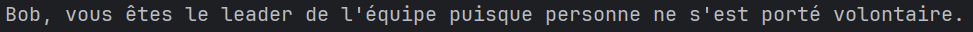

*Si l’utilisateur saisie autre chose qu’un nombre entre 1 et 4, on lui demande une saisie valide.*
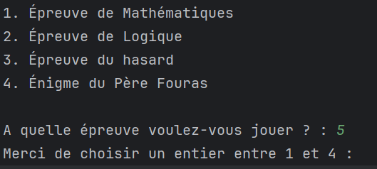

*Si l’équipe n’est composée que d’un seul joueur, il est sélectionné automatiquement pour chaque épreuve.*
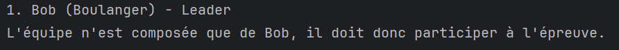

*Pour chaque jeu, on s’assure que la saisie utilisateur est valide.*
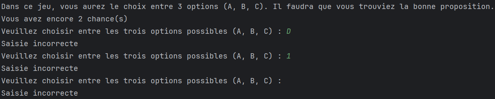

***La stratégie utilisée pour les saisies vides lorsque l’on s’attend à un entier consiste à convertir la saisie de l’utilisateur en entier que lorsque l’on est sûr qu’elle est valide. Ainsi, l’erreur se produisant lors de la conversion d’une saisie vide en entier est impossible.***